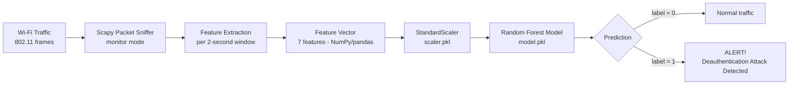
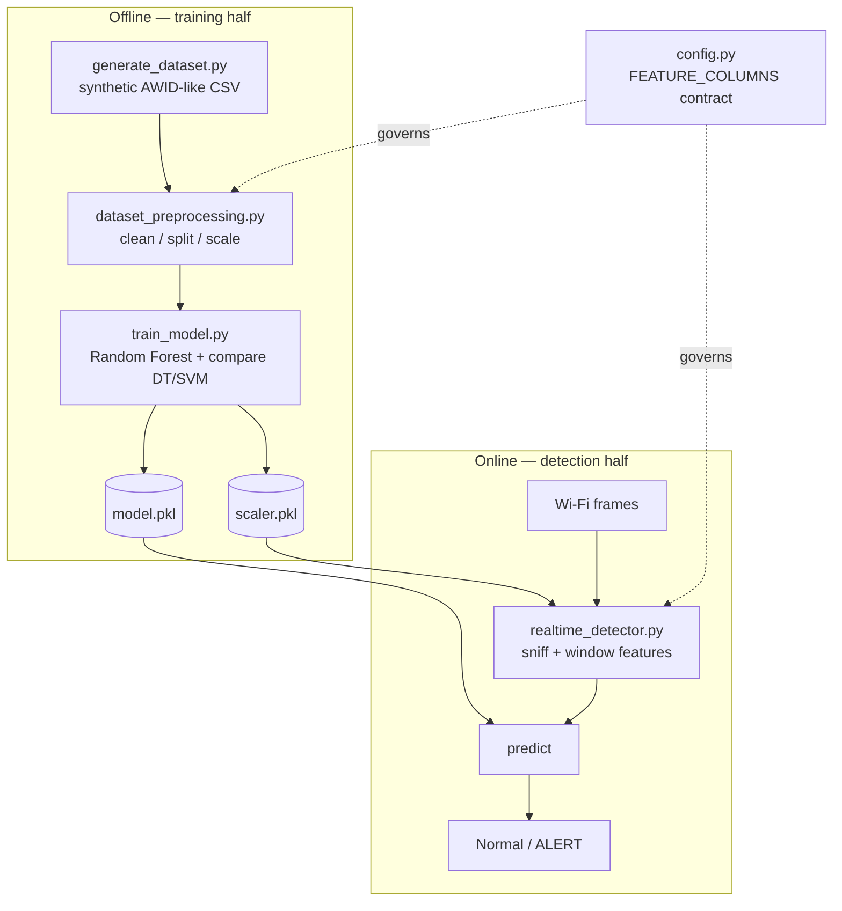

# Architecture & Flowchart

*(Flowchart: Traffic → Feature Extraction → ML Model →
Attack Classification → Alert Generation".)*

## 1. End-to-end data flow (the required flowchart)



Plain-text version (for the report, if Mermaid isn't rendered):

```
Wi-Fi Traffic ─▶ Scapy Sniffer ─▶ Feature Extraction ─▶ 7-feature vector
             ─▶ StandardScaler ─▶ Random Forest ─▶ Prediction
             ─▶  0 = Normal traffic
                 1 = ALERT! Deauthentication Attack Detected
```

## 2. Two halves: offline training vs. online detection



The two halves are decoupled and communicate only through the saved artefacts
`model.pkl` and `scaler.pkl`. `config.py` is the shared contract guaranteeing the
feature vector built at detection time matches what the model was trained on.

## 3. Windowing (why the sniffer batches frames)

```
time ──▶
frames:  d . . d . . . . | D D D D D D D D D | . . d . . . .
         └── window 1 ───┘└─── window 2 ─────┘└── window 3 ──┘
              Normal            ATTACK             Normal
   (d = a stray deauth,  D = attack deauth flood)
```

Each window becomes one 7-feature vector → one prediction. A single deauth (`d`)
is normal; a *burst* (`D…D`) within a window is what tips `deauth_count`,
`packet_rate`, and the MAC-frequency features into the Attack region of the
model's decision boundary.

## 4. Component responsibilities

| Component                 | Input                     | Output                        |
|---------------------------|---------------------------|-------------------------------|
| `generate_dataset.py`     | parameters (row counts)   | labelled CSV                  |
| `dataset_preprocessing.py`| CSV                       | scaled train/test arrays + plots |
| `train_model.py`          | arrays                    | `model.pkl`, `scaler.pkl`, metrics, plots |
| `realtime_detector.py`    | live NIC / pcap / sim     | per-window Normal/ALERT lines |
| `config.py`               | —                         | shared paths + feature schema |
